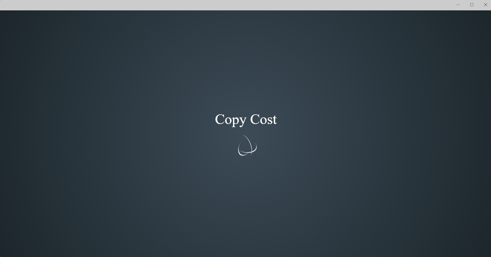
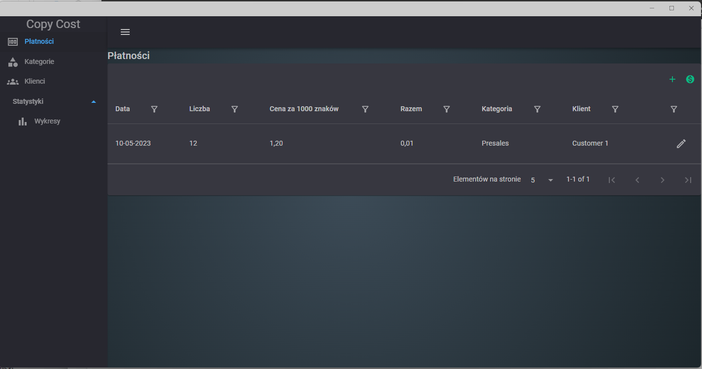
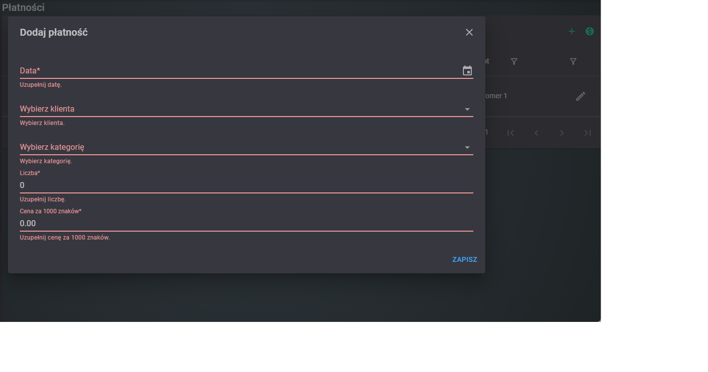
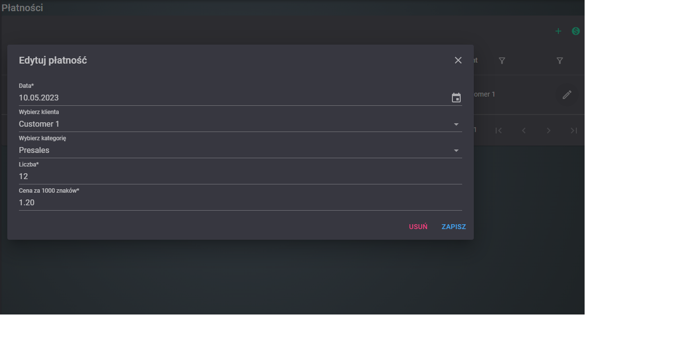
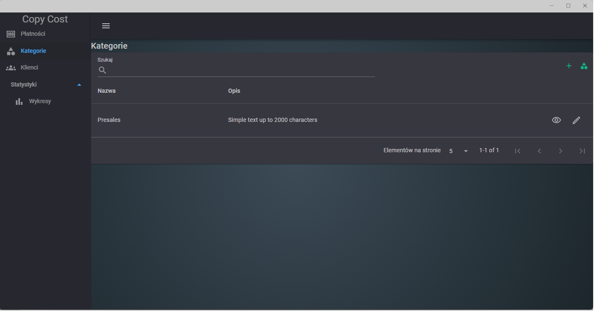
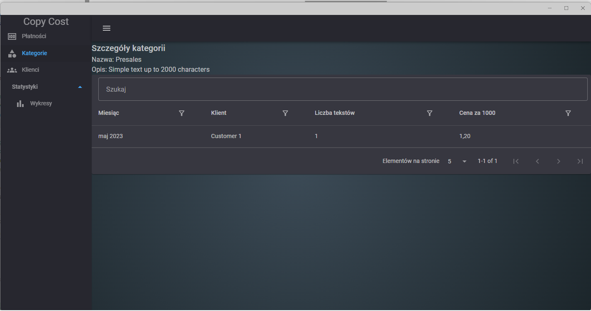
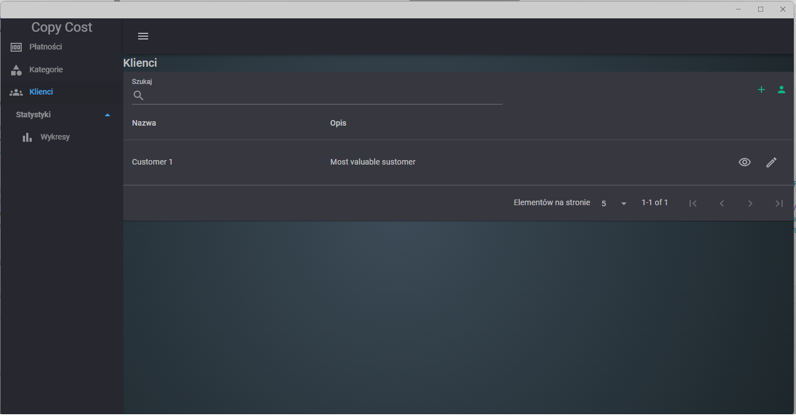
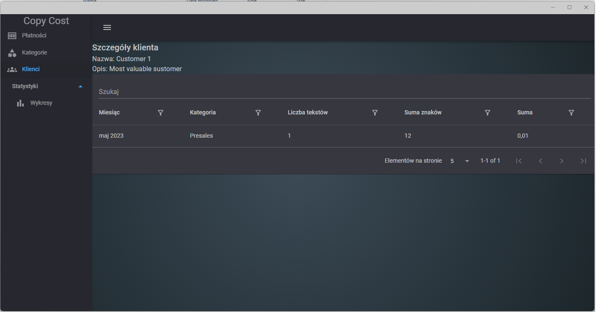
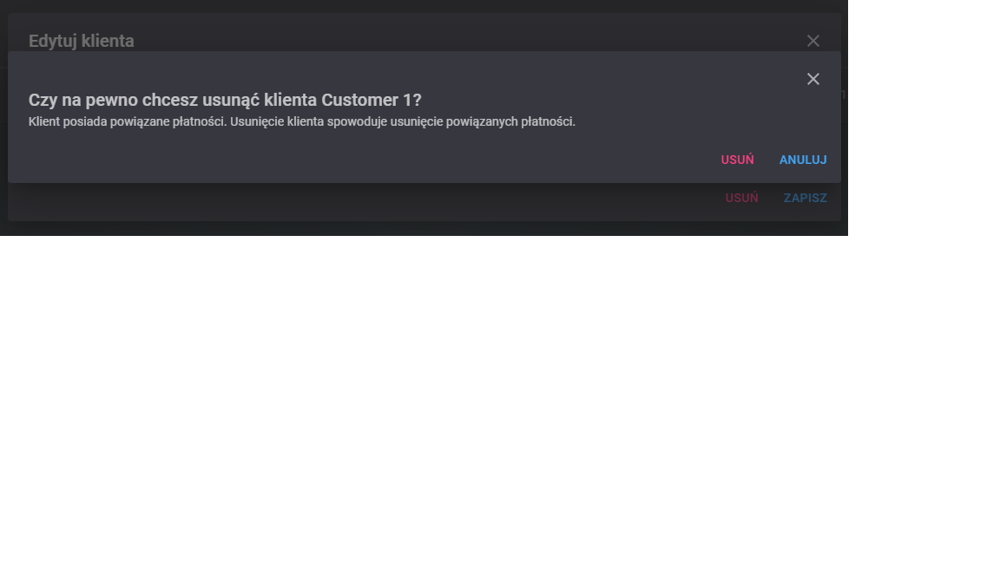
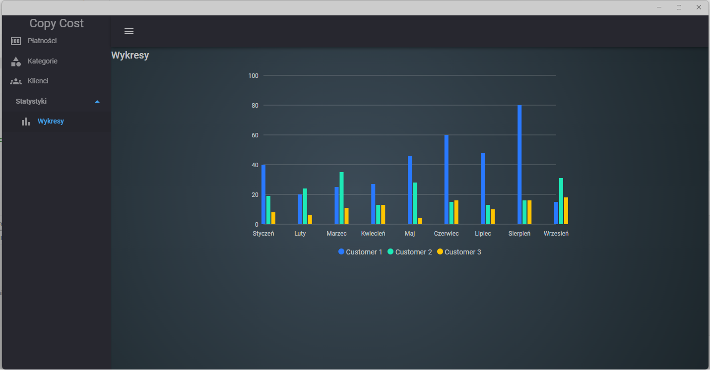

# CopyCost
Copywriter text payment summarization tool for Windows 10 - Maui blazor UWP hybrid application.

## Overview

This is a simple application for summarizing payments for copywriters. It allows you to add customers, categories and payments. It also allows you to generate a summary of payments for a given month and year.

## Screenshots

### Splash screen



### Payments







### Categories





### Customers







### General idea

- Language: PL
- Component library: MudBlazor
- .NET7
- EFCore
- Architecture: x64


## Entities

### Category

```csharp
public class Category
{
    public int Id { get; set; }
    [Required (ErrorMessage = "Nazwa jest wymagana")]
    [StringLength(50, MinimumLength = 3)]
    [Display(Name = "Nazwa kategorii")]
    public string Name { get; set; } = string.Empty;

    [StringLength(100, MinimumLength = 3, ErrorMessage = "Opis musi mieć od 3 do 100 znaków")]
    [Display(Name = "Opis kategorii")]
    public string Description { get; set; } = string.Empty;

    [Display(Name = "Płatności")]
    public List<Payment> Payments { get; set; } = new();

    public override bool Equals(object? o)
    {
        var other = o as Category;
        return other?.Id == Id;
    }

    // ReSharper disable once NonReadonlyMemberInGetHashCode
    public override int GetHashCode() => Id.GetHashCode();
}
```

### Customer

```csharp
public class Customer
{
    public int Id { get; set; }
    [Required(ErrorMessage = "Pole \"{0}\" jest wymagane.")]
    [StringLength(50, MinimumLength = 3, ErrorMessage = "Nazwa musi mieć od 3 do 50 znaków")]

    [Display(Name = "Nazwa klienta")]
    public string Name { get; set; } = string.Empty;

    [StringLength(100, MinimumLength = 3, ErrorMessage = "Opis musi mieć od 3 do 100 znaków")]

    [Display(Name = "Opis klienta")]
    public string Description { get; set; } = string.Empty;

    [Display(Name = "Płatności")]
    public List<Payment> Payments { get; set; } = new();

    public override bool Equals(object? o)
    {
        var other = o as Customer;
        return other?.Id == Id;
    }

    // ReSharper disable once NonReadonlyMemberInGetHashCode
    public override int GetHashCode() => Id.GetHashCode();
}
```

### Payment

```csharp
public class Payment
{
    public int Id { get; set; }
    [Required (ErrorMessage = "Data jest wymagana")]
    [Display(Name = "Data")]
    public DateTime? Date { get; set; }

    [Required(ErrorMessage = "Liczba jest wymagana")]
    [Range(1, int.MaxValue, ErrorMessage = "Liczba musi być większa od 0")]
    [Display(Name = "Liczba")]
    public int Amount { get; set; } = 0;

    [Required (ErrorMessage = "Cena za 1000 znaków jest wymagana")]
    [Range(0.01, double.MaxValue, ErrorMessage = "Cena za 1000 znaków musi być większa od 0")]
    [Display(Name = "Cena za 1000 znaków")]
    public decimal Per1000 { get; set; } = 0.00m;

    [NotMapped]
    [Display(Name = "Razem")]
    public decimal Total => Math.Round(Amount * (Per1000 / 1000m), 2);

    [Required (ErrorMessage = "Kategoria jest wymagana")]
    [Display(Name = "Kategoria")]
    [Range(1, int.MaxValue, ErrorMessage = "Kategoria jest wymagana")]
    public int CategoryId { get; set; }

    public Category Category { get; set; } = new();

    [Required (ErrorMessage = "Klient jest wymagany")]
    [Display(Name = "Klient")]
    [Range(1, int.MaxValue, ErrorMessage = "Klient jest wymagany")]
    public int CustomerId { get; set; }

    public Customer Customer { get; set; } = new();

}
```

## Data transfer objects

### CategoryByText

Used for grouping by category and month/year

```csharp
public class CategoryByText
{
    public string Category { get; set; } = string.Empty;
    public int TextCount { get; set; }
    public int TotalCharacters { get; set; }
    public DateTime MonthYear { get; set; }
    public decimal Total { get; set; }
}
```

### CategorySummary

Used for grouping by customer and month/year

```csharp
public class CategorySummary
{
    public string Customer { get; set; } = string.Empty;
    public DateTime MonthYear { get; set; }
    public int TextCount { get; set; }
    public decimal PricePer1000 { get; set; }
}
```

### Error handling

Used for returning errors from user input

```csharp
public class OperationResult
{
    public bool IsSuccess { get; private init; }
    public Dictionary<string, string> Errors { get; set; } = new();
    public string Message { get; private set; } = string.Empty;

    public static OperationResult Failed(string key, string value)
        => new() { IsSuccess = false, Errors = new Dictionary<string, string> { { key, value } } };

    public static OperationResult Failed(Dictionary<string, string> errors)
        => new() { IsSuccess = false, Errors = errors };

    public static OperationResult Success(string message)
        => new() { IsSuccess = true , Message = message };
}
```

## To do

- [ ] Charts




## How to run

1. Clone repository
2. Open in Visual Studio
3. Run